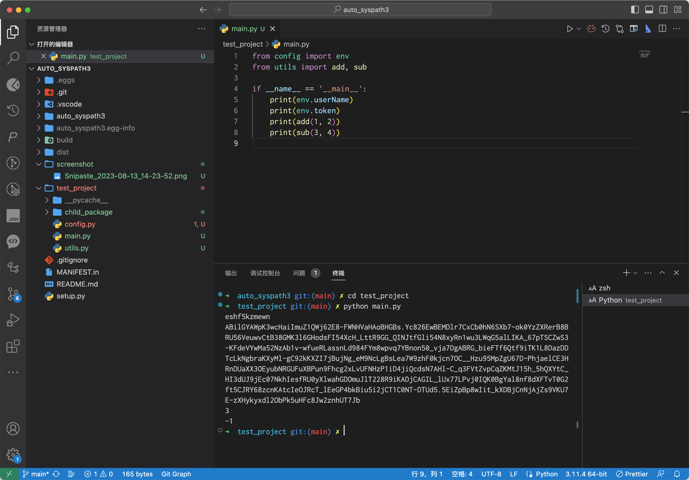
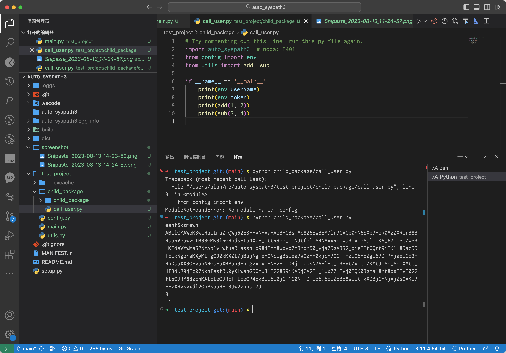
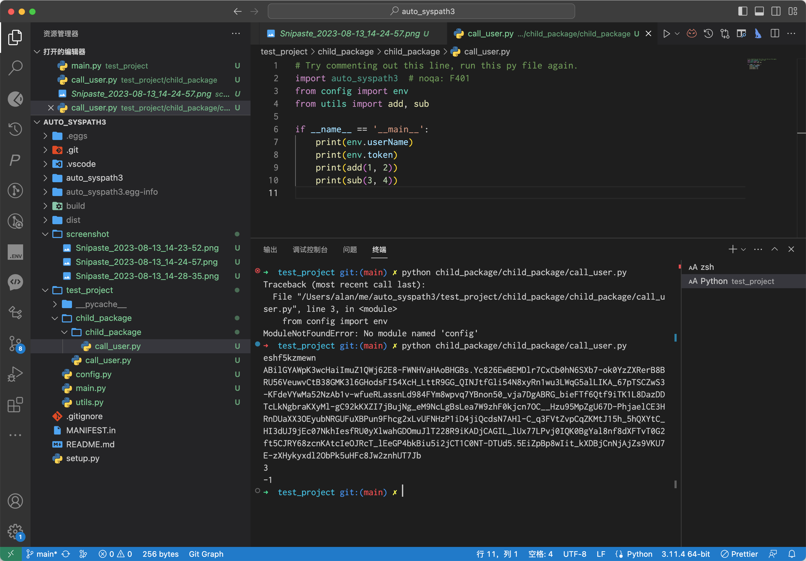

<a href=./README.md alt=./README.md>Switch to English</a>

### 1.使用方法:

1. 安装(语法未使用最新`Python`版本，所以应当兼容大多数以上的`Python3`版本)

- 当前已发布至PyPI,直接使用`pip install auto_syspath3`安装

```bash
git clone https://github.com/Alan3344/auto_syspath3.git
cd auto_syspath3
Python setup.py install
```

或者

```bash
pip install git+https://github.com/Alan3344/auto_syspath3.git
```

2. 使用

不用再在每个文档的开头加上这两行了，因为这会招来烦人的`Flake8`波浪线〰️提示`Flake8(E402)`

- 强迫症患者表示不太愿意接受

```python
import sys
sys.path.extend(['./', '../'])

from utils import login
from config import env
```

现在只需要直接在自定义包前面加上这一行就可以了,如果你不喜欢`Flake8`提示未使用,可以在后面加上 `# noqa`

只需要在自定义的模块前面引用它就可以了

- 根据`Python`导入模块的特性,这个`__init__.py`文件会自动执行,所以也不需要再写`add_path()`函数了

```python
import os
import auto_syspath3 # noqa
from utils import quit
from config import env
```

### 2.拒绝`Flake8`提示检测: module level import not at top of file Flake8(E402)

- 原因: 为了让这个文件可以单独运行, 所以把`import`放到了函数里面

### 3.编写这个模块的原因:

我使用`VSCode`编写`Python`代码的,但是`VSCode`导入是正确提示,但是`Flake8`提示错误
可能使用`PyCharm`不会有这个问题,但是他需要设置为`source root`,我不喜欢这样

1. 这个函数原本的样子,每次引用,都得复制一遍
2. 其次这个文件主要是放在`site-packages`目录,打包后发给别人使用会缺少这个文件
3. 我在`pypi`上有找到类似的包,但是未能达到我的预期,所以自己写了一个
4. 重要的是,使用这个包后,自定义的包在任何一个终端都可以使用,不需要设置`source root`

```python
def add_path(path=__file__, deep=0):
    """Add a path to the sys.path if it is not already there."""
    paths = []
    path = os.path.abspath(path)
    dirname = os.path.dirname(path)
    for i in range(deep):
        dirname = os.path.dirname(dirname)
    d(f'dirname: {dirname}')
    for p in os.walk(dirname):
        p0 = p[0].replace(dirname, '')
        if p0.startswith('/.') or '__pycache__' in p0:
            continue
        elif not p[0] in sys.path:
            paths.append(p[0])
            sys.path.insert(0, p[0])
            d(f'add path: {p[0]}')
    return paths
```

### 使用过程中截图

- 解决子包`py`文件导入顶层模块方法时时的报错: `ModuleNotFoundError: No module named '包名'`

- 正常情况我们的`pwd`路径都是在顶层目录,这时候我们可以直接运行`main.py`文件当然我直接运行`python test_project/main.py`也没有任何问题

1. 假如你的项目结构是这样,其中`main.py`文件是入口文件,`child_package`是自定义的包,`child_package/child_package`是自定义包的子包，它们都内置有具体的`py`文件
   

2. 直接在入口文件在`main.py`文件运行是这样的
   

3. 在`child_package/call_user.py`文件运行是这样的,第一次运行报错是因为了注释掉了`import auto_syspath3 # noqa F401`这一行
   

4. 在`child_package/child_package/call_user.py`文件运行是这样的,第一次运行报错是因为了注释掉了`import auto_syspath3 # noqa F401`这一行
   
